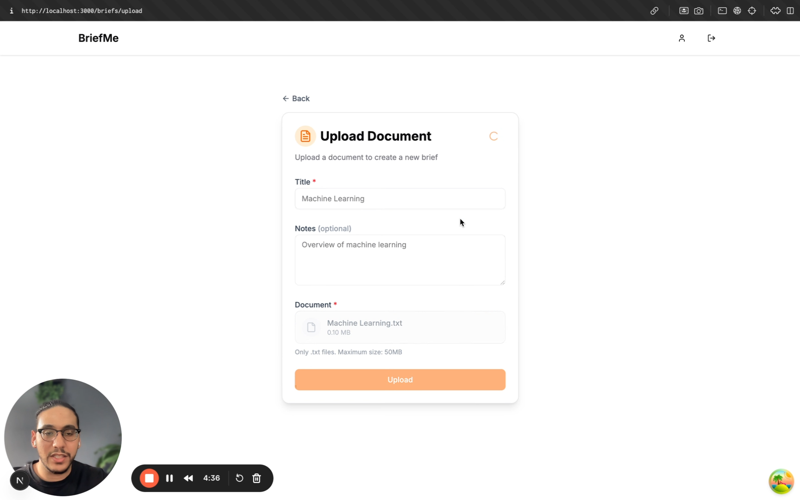

# BriefMe

A full-stack document summarization application built with Next.js, TypeScript, tRPC, and Supabase.

<div align="center">
  <a href="https://www.loom.com/share/c5287f31795e4b6bbc854b551377159a?sid=4fab83d8-797a-4ddc-b6fb-46bc229702ff">
    
    <br>
    <sub>🎥 Watch the demo video to see BriefMe in action</sub>
  </a>
</div>

## Overview

BriefMe allows users to upload text documents (up to 50MB), attach notes, and receive AI-generated summaries powered by OpenAI. Built with full-stack type safety using tRPC and TypeScript, every API route and data structure is strictly typed for a smooth developer experience with complete autocompletion and zero runtime type errors.

Key features include secure authentication, a responsive UI, and an adaptive summarization pipeline that scales from short documents to multi-million-line files.

The backend adjusts processing based on document size:

- **Small Documents**: Direct summarization using GPT-4o Mini for quick and efficient processing
- **Large Documents**: Advanced processing pipeline that:
  - Splits documents into 1000-character chunks with 100-character overlaps, preserving semantic coherence
  - Generates embeddings for each chunk using OpenAI's text-embedding-3-small model
  - Uses parallel processing with rate limiting (10 concurrent calls) for efficient processing
  - Applies cosine similarity to identify the top 20 most semantically relevant chunks
  - Generates a final summary from the most relevant content
- **Robust Error Handling**: Implements exponential backoff retry mechanisms and fallback strategies

This adaptive approach allows BriefMe to efficiently process documents of any size, from short texts to documents with millions of lines, while maintaining high-quality summarization.

## Assessment Requirements & Implementation

This project was built to meet the following requirements:

### Frontend

- **React with TypeScript**: Implemented with Next.js 14+ and strict TypeScript
- **Responsive Design**: Fully responsive UI that adapts to both desktop and mobile
- **Required Components**:
  - File upload for .txt files up to 50MB
  - Optional user input for notes
  - Submit button that triggers upload and processing
  - Dynamic rendering of document and summary as they become available

### Backend/API

- **Supabase Integration**: Used for storage, database, and authentication
- **Background Processing**: Implements an intelligent document summarization service
- **LLM Integration**: Uses OpenAI's GPT-4o Mini for high-quality summarization
- **Data Storage**: Securely stores documents and summaries in Supabase

### Technical Requirements

- **Secure Storage**: Files are not publicly accessible, signed URLs with expiration
- **Clean Architecture**: Separation of concerns with well-defined layers
- **User-Specific Access**: Row-level security enforces user isolation
- **Environment Variables**: Comprehensive setup for both frontend and backend

### Bonus Features

- **Robust Processing Flow**: Handles large documents with:
  - Semantic chunking and overlap
  - Embedding-based retrieval for large documents
  - Parallel processing with rate limiting
  - Exponential backoff retry mechanism
- **User-Specific Storage**: Documents stored in user-specific folders
- **Upgraded UI**: Clean, intuitive interface with responsive components
- **Search Functionality**: Search across document titles, notes, and summaries

## Architecture

BriefMe follows a clean architecture pattern with clear separation of concerns:

```
BriefMe/
├── app/                # Frontend (Next.js)
│   ├── app/            # Next.js App Router
│   ├── components/     # React components
│   ├── hooks/          # React hooks
│   ├── providers/      # Context providers
│   ├── services/       # API services
│   ├── stores/         # State management
│   └── utils/          # Utilities
│
└── api/                # Backend (Node.js, tRPC)
    ├── src/
    │   ├── trpc/       # tRPC routers and procedures
    │   ├── services/   # Business logic services
    │   └── utils/      # Utilities
    └── ...
```

### Key Features:

1. **Type-Safe API Communication**: End-to-end type safety with tRPC
2. **Secure Authentication**: HTTP-only cookies with JWT tokens
3. **Intelligent Summarization**: Adaptive processing based on document size
4. **Optimized State Management**: Zustand for client state, React Query for server state

## Getting Started

### Prerequisites

- Node.js 16+
- pnpm
- Supabase account
- OpenAI API key

### Installation

For detailed installation instructions:

- **Backend**: See [Backend Documentation](./api/README.md)
- **Frontend**: See [Frontend Documentation](./app/README.md)

## Detailed Documentation

- [Frontend Documentation](./app/README.md) - Details on the Next.js application
- [Backend Documentation](./api/README.md) - Details on the API and summarization service

## Usage

1. **Sign up/Login**: Create an account or login to access the application
2. **Upload Document**: Use the upload page to submit a text file (up to 50MB) with optional notes
3. **View Summary**: After processing, the summary will appear on the brief detail page
4. **Search Documents**: Use the search functionality to find documents by title, notes, or summary content
5. **Regenerate Summary**: If needed, you can request a new summary for any document

## Technologies Used

### Frontend

- Next.js 14+ (App Router)
- TypeScript
- Tailwind CSS with Shadcn UI
- Zustand for state management
- TanStack Query (React Query)
- tRPC client

### Backend

- Node.js with TypeScript
- tRPC for API
- Express.js
- OpenAI API (GPT-4o Mini)
- Supabase (Auth, Storage, Database)
